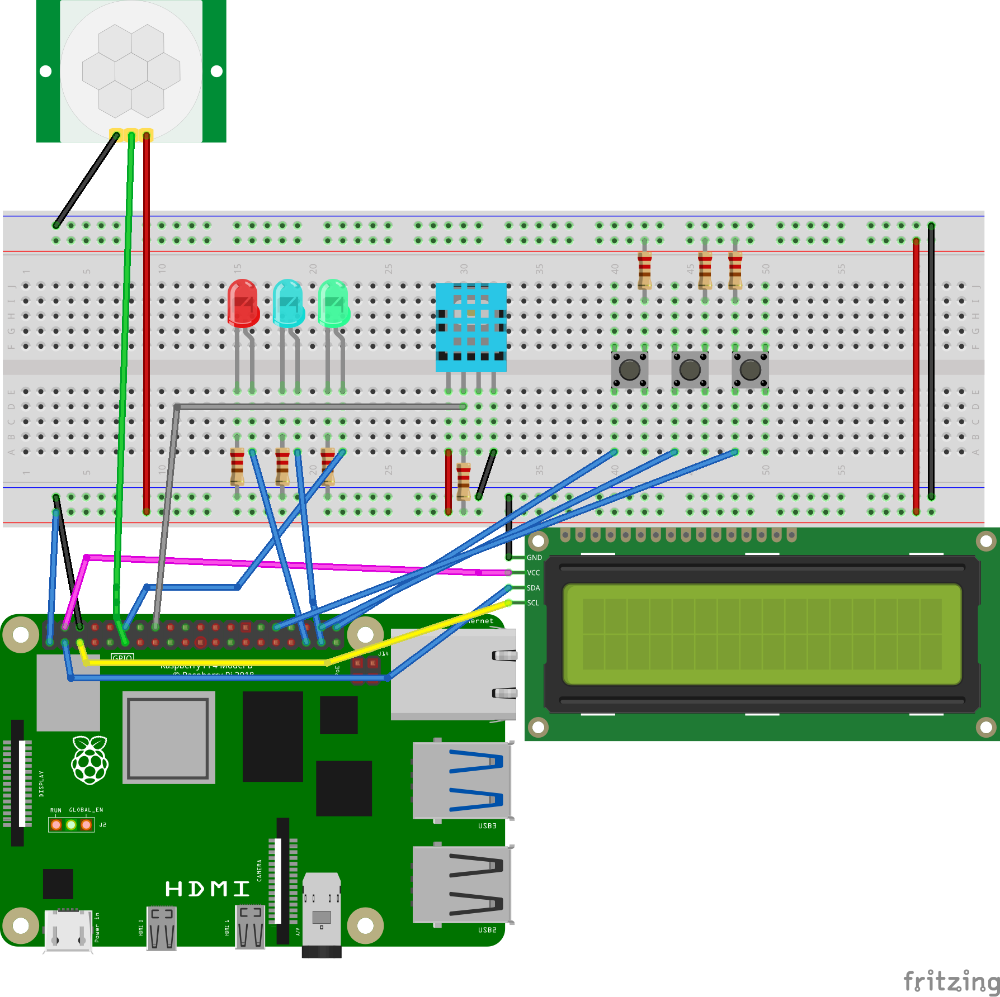

# raspPiHVAC
This was my final project for my Processor Hardware/Software Interfaces course. It is meant to simulate a simple HVAC using a Raspberry Pi.  
Some aditional hardware is required:
<ul>
    -3 push buttons
    -3 LEDs (red, blue, and green)
    -1 DHT-11 Temp/Humid Sensor
    -1 I2C LCD Display
    -1 PIR Motion Sensor 
    -7 Resistors
    </ul>

Schematic for hardware:
